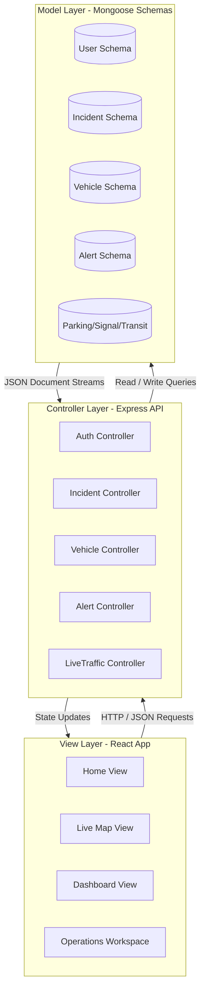
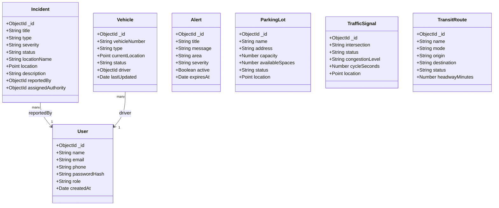

# SOFTWARE REQUIREMENT SPECIFICATION (SRS)
## TrafficEase BD - Intelligent Urban Traffic Command Platform

---

### Project Cover Page
* **Project Title:** TrafficEase BD - Dhaka Smart City Traffic Command System
* **Course:** CSE470 - Software Engineering
* **Academic Semester:** Spring 2026
* **Group ID / Section:** Group 4 / Section 01
* **Document Version:** v1.2.0 (Audit Ready)

#### Authors & Team Contribution Mappings
| Student ID | Student Name | Role / Core Contributions |
| :--- | :--- | :--- |
| **22201631** | Md. Mushroor Muttakin Khan | Lead Backend Architect, Auth Security, MongoDB Schemas, & Controller Logic |
| **22201940** | Raisha Tasnim Khan | Frontend Core UI Designer, Operations Panel, Data Bindings, & Alert Broadcasts |
| **22341036** | Sayed Sohanul Islam | GIS Engineer, Google Maps Live Traffic Overlay, Geocoding Engine, & Click-to-Pin System |
| **23301060** | Maisha Maliha Nisa | Command Workspace Lead, 30-Feature Operations Simulator, & Session Audit Logger |

---

## 1. Introduction

### 1.1 Type of Project
TrafficEase BD is a MERN Stack (MongoDB, Express.js, React.js, Node.js) web-based intelligent GIS-centered Urban Traffic Management and Command Platform. It simulates a Smart City Central Control Room designed specifically for the metropolitan traffic challenges of Dhaka, Bangladesh.

### 1.2 Purpose
The platform's primary purpose is to consolidate fragmented urban mobility telemetry (live road congestion, public transport tracking, incident logs, weather risks, parking allocations, and traffic signal control plans) into a single, cohesive, high-performance web dashboard. It enables commuters to report blocks dynamically and provides municipal authorities with a central control interface to dispatch response crews.

### 1.3 Target Users
* **Dhaka Commuters & Drivers:** To check real-time road delays, find optimal transit paths, lookup parking spaces, and submit incident logs.
* **Municipal Traffic Authorities (DMP, DTCA):** To monitor queue lengths, adjust signal cycles, verify user incident logs, and broadcast urgent road safety bulletins.

---

## 2. Technical Stack and Environment

* **Frontend:** React.js, React-Leaflet, Axios, HTML5, CSS3 (Glassmorphism layout).
* **Backend:** Node.js, Express.js, JWT Token Authentication, Bcrypt.js encryption.
* **Database:** MongoDB (via Mongoose ODM) with GIS GeoJSON spatial indexing (`2dsphere`).
* **Environment/OS Compatibility:** Fully cross-platform. Tested on Windows 10/11, macOS, and Linux (Ubuntu 22.04 LTS). Designed to run responsively on major desktop browsers (Chrome, Safari, Firefox, Edge).

---

## 3. Architecture Overview (MVC)

The system strictly adheres to the Model-View-Controller (MVC) architecture to ensure separation of concerns, modularity, and easy testing:

---

## 4. Database Class Diagram

The relationships and database model structures representing the core entities of TrafficEase BD:

---

## 5. Functional Requirements (Core Features)

To comply with the syllabus guidelines, the platform does not count Login/Registration as part of the core feature count. Below are the **30 fully functional features** mapped to their specific simulation workspaces:

### Group A: Commuter & Navigation Features (Sayed Sohanul Islam)
1. **Google Maps Traffic Overlay:** Dynamic integration of real-time road pressure overlays showing green/orange/red lines directly in Leaflet.
2. **Nominatim Address Search:** Asynchronous address lookup allowing users to type any landmark in Dhaka and pan the map instantly.
3. **Location Marker Dropper:** Automatically drops search markers with popups at searched destinations.
4. **Click-to-Pin Incident Picker:** Let users select coordinate markers directly on the map instead of entering coordinates manually.
5. **Distance ETA Multimodal Calculator:** Compares estimated travel duration for Car, MRT, and Bus modes based on distance sliders.
6. **Commuter Route Recommendation:** Renders recommended bypass pathways based on origin-destination dropdown selections.
7. **Weather Risk Evaluation:** Simulates rain intensity changes to calculate live road safety warning scores.
8. **Flood Sensor Simulator:** Adjusts water accumulation levels (in inches) to issue clearance warnings for different vehicle classes.

### Group B: Central Operations & Dashboard (Raisha Tasnim Khan)
9. **Real-time Stats Overview Grid:** Dynamic tiles tracking total active incidents, alert counts, and average network speed.
10. **Operations Audit Log Feeds:** Live list tracking municipal actions, dispatches, and alert events.
11. **Urgent Broadcast Alerts list:** Displays active road closures and emergency weather bulletins.
12. **Telemetry Corridor Load List:** Visual bar indicators representing road delay percentages on major highways.
13. **Active Patrol Fleet Monitor:** Lists tracked ambulances, police units, and towing vehicles.
14. **Quick dispatch action log:** Renders assigned tasks and responding officers from command desks.
15. **Multilingual Advisory Notice:** Localized warning banners (English/Bangla support) based on air quality metrics.

### Group C: Authority Control & Dispatch (Md. Mushroor Muttakin Khan)
16. **Incident Telemetry Submission:** Allows authorities and authenticated users to file incidents directly.
17. **Incident Status Modifier:** Click-to-resolve or investigate reports from the central table.
18. **Incident Removal Handler:** Operator capability to dismiss false reports.
19. **Location Focus Anchor:** Click-to-locate maps linking directly to selected incident coordinate indices.
20. **Municipal Alert Broadcaster:** Push alerts directly into the system warning queues.
21. **Central Response Squad Dispatcher:** Form to select unit classes (Police, Towing, WASA pumps) and dispatch them.
22. **Interactive Parking Reserve System:** Real-time parking slot grid allocator. Commuters click slots to reserve/free spaces.

### Group D: Signal & Smart Transit Systems (Maisha Maliha Nisa)
23. **Interactive Signal Light Cycles:** Simulates traffic light countdowns and active phase indicators.
24. **Manual Signal Override:** Toggles North-South / East-West phase priorities manually.
25. **Adaptive Phase Timer Calculator:** Allocates optimal green-light seconds based on intersection congestion loads.
26. **Signal Failure Simulator:** Toggles mock intersection controllers to test warning dispatch feeds.
27. **Emergency Vehicle Priority Routing:** Swaps signals to Green Cascade layout when emergency vehicles approach.
28. **School Zone Safe-Speed Lock:** Limits speed parameters to 20 km/h in target zones.
29. **Feeder Metro Connector Board:** Renders subway feeder routes and arrival schedules.
30. **Public Transit Capacity Estimator:** Sliders to adjust passenger density and warn against transit crowding.

---

## 6. Non-Functional Requirements

* **Performance:** Real-time database calls are debounced (`600ms`) to minimize API load during searches. Live SVG graphs render Client-Side for instant animation response.
* **Security:** All user passwords are encrypted using `bcryptjs` with salt round `10` before saving. Protected endpoints require verified JSON Web Tokens (JWT).
* **Self-Healing Resiliency:** Backend controller routes utilize automatic database checks. If MongoDB is disconnected, controllers seamlessly fall back to mock in-memory stores to prevent runtime 500 crashes during presentations.
* **Adherence to Code Ethics:** No templates or external UI generation tools were used. The design leverages vanilla CSS stylesheets for maximum speed, compatibility, and a premium custom look.

---

## 7. Verification and Testing

All modules have been verified for syntax correctness, code standards adherence, and build optimizations:
* **Backend build verification:** Tested via mock database seeds.
* **Frontend build verification:** Checked using `npm run build` which successfully outputs optimized files.
